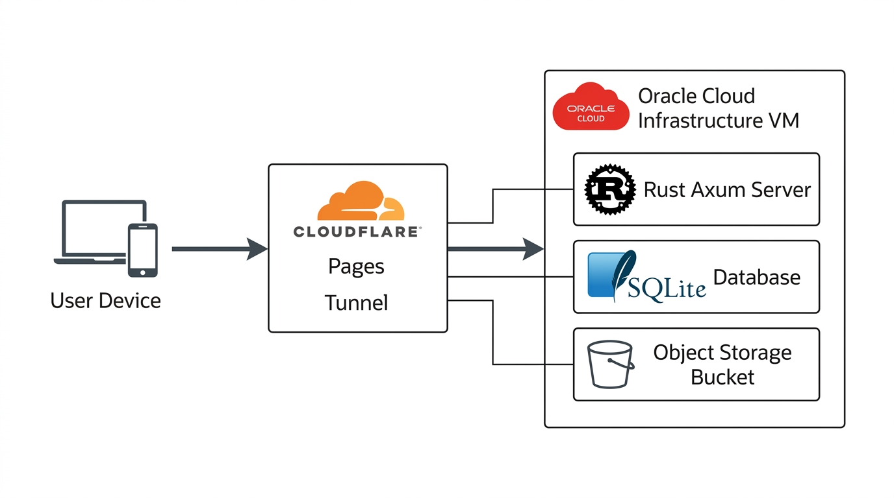
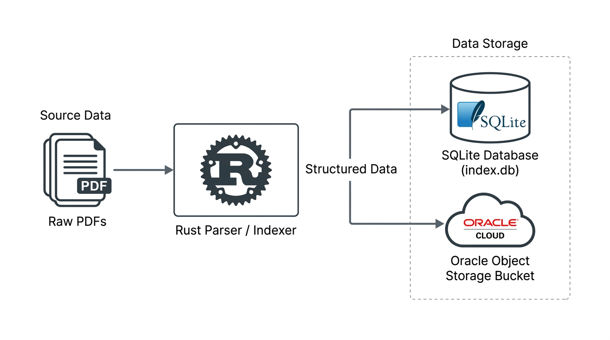

<div align="center">
  <h1 align="center">Amrita Exam Papers Search Engine</h1>
  <p align="center">
    A high-performance, full-text searchable archive of over 19,600 examination papers from Amrita Vishwa Vidyapeetham. Built with Rust, SQLite, and Cloudflare Pages for speed, low latency, and efficient querying.
    <br/>
    <br/>
    <a href="https://exampapersamrita.pages.dev"><strong>View Live Site</strong></a>
  </p>
  
  <!-- Badges -->
  <p align="center">
    
    
    
    
  </p>
</div>

## Features

- **Full-Text Search**: Uses SQLite FTS5 for index search queries across 19,600+ papers.
- **Facet Filtering**: Filter papers by Department, Degree Program, Course Category, and Academic Year.
- **Batch Downloading**: Select multiple examination papers and download them as a single compressed ZIP archive.
- **Responsive Interface**: Mobile-first frontend built with TailwindCSS and Alpine.js.
- **Deterministic Sorting**: Explicit sort options (`code_asc`, `year_asc`, `title_asc`) always override relevance ranking; every ordering carries a stable `p.id ASC` tiebreaker so pagination boundaries never shift between requests.
- **Sanitized Title Sorting**: Title A-Z sorts by the *cleaned* title. The database stores raw pdftotext extraction output (with junk prefixes), but a registered SQLite scalar function `clean_title(course_title, course_code)` applies the same sanitizer at query time that the API uses for display -- so what you see is what gets sorted. Papers whose extraction failed (fallback titles like `15CSE101 Examination Paper`) sink to the end of the list instead of flooding the top.

## System Architecture

The application routes traffic through Cloudflare edge caching to an isolated Oracle Cloud Infrastructure (OCI) Virtual Machine via Cloudflare Tunnel.



### Components
1. **Frontend**: Cloudflare Pages (`exampapersamrita.pages.dev`). Proxies `/api/*` to the OCI origin via a Cloudflare Worker proxy (`worker/index.js`).
2. **Backend**: An Oracle Cloud Linux VM running a Rust Axum HTTP server and SQLite FTS5 database.
3. **Tunnel**: Port 80 on the VM is exposed exclusively via Cloudflare Tunnel (`cloudflared`).
4. **Storage**: Oracle Object Storage hosts 9+ GB of PDFs. The backend generates relative CDN routing mappings to serve these assets.

## Data Pipeline

A multi-stage pipeline of Rust binaries extracts metadata, manages database transactions, and synchronizes assets to cloud object storage.



## Development and Deployment Setup

### Local Development

#### 1. Prerequisites
- Rust toolchain (stable, 1.75+)
- SQLite 3 with FTS5 extension enabled
- Rclone (for object storage synchronization)

#### 2. Run the API Server
Start the Axum backend locally on port 3000:
```bash
cargo run --release --bin server
```

#### 3. Database Indexing and Sync
Scan the raw PDF dataset, extract metadata (course codes, departments, academic years), compute SHA256 hashes, and populate `index.db`:
```bash
cargo run --release --bin db_sync
```

#### 4. Object Storage Upload
Synchronize processed PDFs from local storage to Oracle Object Storage via Rclone:
```bash
cargo run --release --bin upload
```

#### 5. Frontend Development
The web client in `web/index.html` is a standalone Alpine.js and TailwindCSS bundle. Serve it with any static file server:
```bash
cd web
python3 -m http.server 8080
```
Set `window.AMRITA_API_BASE = "http://localhost:3000"` in the console or HTML header to direct API requests to your local backend.

---

### Oracle Cloud Infrastructure (OCI) Deployment

The production backend runs on an Oracle Cloud Free Tier instance (`VM.Standard.E2.1.Micro`: 1 OCPU, 1 GB RAM, Oracle Linux 8/9).

#### 1. Swap Memory Allocation
Because `rustc` compilation can exceed 1 GB of physical RAM, configure a 4 GB swap file to prevent out-of-memory (OOM) kernel panics:
```bash
sudo fallocate -l 4G /swapfile
sudo chmod 600 /swapfile
sudo mkswap /swapfile
sudo swapon /swapfile
echo '/swapfile none swap sw 0 0' | sudo tee -a /etc/fstab
```

#### 2. Resource-Constrained Compilation
Native compilation on 1-core, 1 GB RAM instances requires restricting compiler concurrency and link-time optimizations:

In `Cargo.toml`:
```toml
[profile.release]
lto = false
codegen-units = 16
opt-level = 3
```

Compile with a single job thread detached from terminal SIGHUP:
```bash
nohup cargo build --release --bin server -j 1 > build.log 2>&1 &
```

#### 3. Daemonization with Systemd
Install the binary and configure a systemd unit to manage the process on port 80:
```bash
sudo cp target/release/server /usr/local/bin/amrita-server
sudo chmod 755 /usr/local/bin/amrita-server
```

Create `/etc/systemd/system/amrita-server.service`:
```ini
[Unit]
Description=Amrita Exam Papers Search Backend
After=network.target

[Service]
Type=simple
User=opc
WorkingDirectory=/home/opc/amrita-dl
ExecStart=/usr/local/bin/amrita-server
Restart=always
RestartSec=5
Environment=PORT=80

[Install]
WantedBy=multi-user.target
```

Enable and start the service:
```bash
sudo systemctl daemon-reload
sudo systemctl enable --now amrita-server
```

#### Deploying Backend Updates
The VM is not git-managed; updates are pushed over SCP and rebuilt in place:
```bash
scp Cargo.toml Cargo.lock opc@<VM_IP>:~/
scp src/main.rs opc@<VM_IP>:~/src/
scp src/bin/*.rs opc@<VM_IP>:~/src/bin/
ssh opc@<VM_IP> "~/.cargo/bin/cargo build --release --bin server -j 1"
# -j 1 is mandatory: the 1GB VM OOMs on parallel linking
ssh opc@<VM_IP> "sudo systemctl stop amrita-server && \
  sudo cp ~/target/release/server /usr/local/bin/amrita-server && \
  sudo systemctl start amrita-server"
# stop-before-copy is mandatory: copying over a running binary fails with 'Text file busy'
```
Note: the systemd unit runs `/usr/local/bin/amrita-server` but the Cargo binary target is named `server`. The copy step bridges the name gap.

---

### Edge Network and Ingress Configuration

#### 1. Cloudflare Tunnel (`cloudflared`)
Traffic is routed from Cloudflare to the OCI VM via an encrypted outbound tunnel, eliminating the need for public IP exposure or open firewall ports.

Install and daemonize `cloudflared`:
```bash
curl -fsSL https://github.com/cloudflare/cloudflared/releases/latest/download/cloudflared-linux-amd64 -o /tmp/cloudflared
sudo mv /tmp/cloudflared /usr/local/bin/cloudflared
sudo chmod +x /usr/local/bin/cloudflared
```

Create `/etc/systemd/system/cloudflared-tunnel.service`:
```ini
[Unit]
Description=Cloudflare Tunnel to amrita-server
After=network.target amrita-server.service

[Service]
Type=simple
User=opc
ExecStart=/usr/local/bin/cloudflared tunnel --url http://localhost:80 --logfile /home/opc/tunnel.log
Restart=always
RestartSec=5

[Install]
WantedBy=multi-user.target
```

Enable and start the tunnel daemon:
```bash
sudo systemctl daemon-reload
sudo systemctl enable --now cloudflared-tunnel
```

#### 2. Cloudflare Pages Functions (API Proxy)
The static frontend is hosted on Cloudflare Pages. API requests (`/api/*`) are proxied directly to the Cloudflare Tunnel hostname using `functions/api/[[path]].js`:
```javascript
export async function onRequest(context) {
    const url = new URL(context.request.url);
    const backendOrigin = context.env.OCI_ORIGIN;
    const targetUrl = `${backendOrigin}${url.pathname}${url.search}`;
    
    return fetch(targetUrl, {
        method: context.request.method,
        headers: context.request.headers,
        body: context.request.body
    });
}
```

---

### Storage Configuration (Oracle Object Storage)

PDF binaries (9+ GB total) are stored in an unlisted Oracle Cloud Object Storage bucket.

#### 1. Rclone Configuration
Configure Rclone (`rclone config`) with OCI S3-compatible credentials or native OCI provider keys:
```ini
[oracle-amrita-papers]
type = s3
provider = Other
env_auth = false
access_key_id = <OCI_CUSTOMER_SECRET_KEY_ID>
secret_access_key = <OCI_CUSTOMER_SECRET_KEY>
endpoint = https://<namespace>.compat.objectstorage.<region>.oraclecloud.com
acl = private
```

#### 2. Synchronizing Files
Upload files structured by SHA256 hashes to prevent namespace collision:
```bash
rclone sync /path/to/local/papers/ oracle-amrita-papers:exam_papers_vault/ --transfers 16 --checkers 32
```

---

### Frontend Auto-Deploy (GitHub Actions)
The frontend deploys automatically: every push to `main` runs `.github/workflows/deploy.yml`, which uploads `web/` to Cloudflare Pages via `cloudflare/pages-action@v1`.

Required repository secrets (Settings -> Secrets and variables -> Actions):
- `CLOUDFLARE_API_TOKEN` -- must include **Account | Cloudflare Pages | Edit** permission. A token with only read or Workers permissions fails the action's upload-token endpoint with Cloudflare error code `10000`.
- `CLOUDFLARE_ACCOUNT_ID`

Manual trigger: Actions -> Deploy to Cloudflare Pages -> Run workflow.

**Backend is NOT auto-deployed** -- see "Deploying Backend Updates" above.

---

## War Stories

Fifty-plus postmortem scenarios covering every infrastructure battle -- SQLite locking, tunnel failures, token scopes, sort-ranking bugs, ASCII documentation discipline -- live in [docs/scenarios/](./docs/scenarios/README.md).
